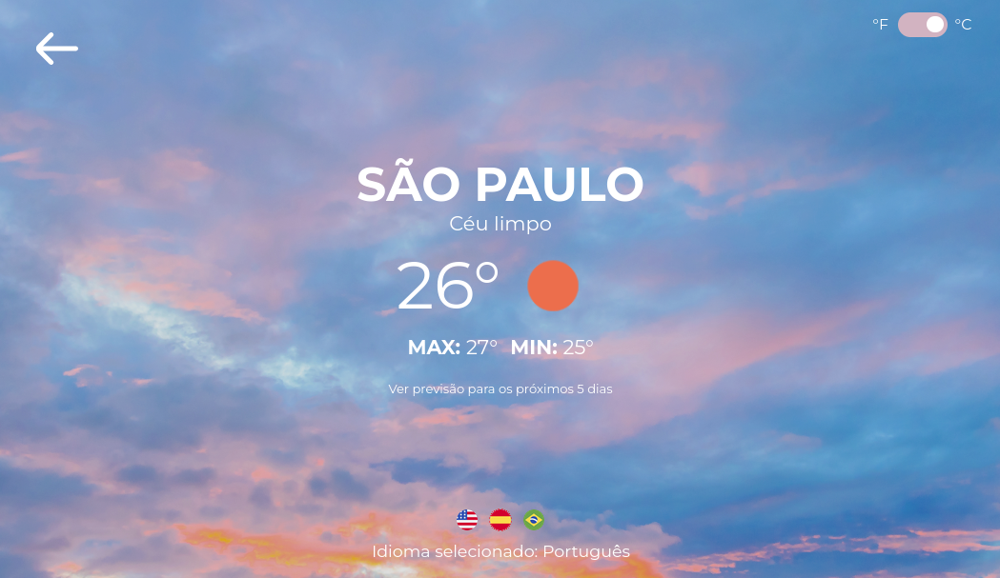
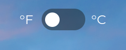
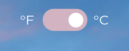
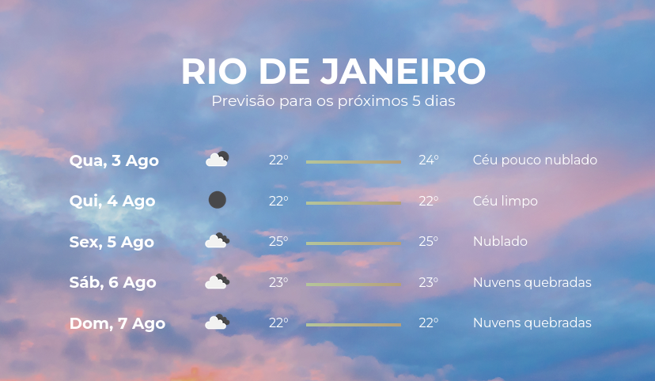
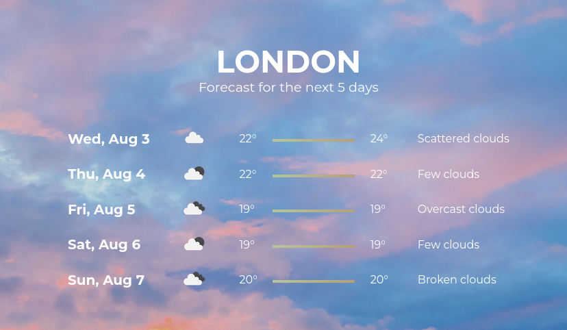

# Weather App

Interface para previsão de tempo, com opções para troca de escala e sistema de internacionalização.

<div>


</div>

[Web app](https://weather-c5ctwtcyc-c836.vercel.app/)<br></br>

</div>

## 💻 Sobre

A aplicação consiste em uma interface que exibe o clima do local selecionado, utilizando o framework ReactJS e o sistema testes por meio do Jest. Todas as requisições são feitas utilizando o client AXIOS. O endpoint utilizado para a busca de locais é feito por meio das API [Geoapifiy](https://www.geoapify.com/), e [OpenWeatherMap](https://openweathermap.org/) para a busca de previsão e clima.

### Features

- Opções para troca de escala

| Fahrenheit                               | Celcius                                   |
| ---------------------------------------- | ----------------------------------------- |
|  |  |

- Sistema de internacionalização

| Português                             | Inglês                                 |
| ------------------------------------- | -------------------------------------- |
|  |  |

- Previsão do tempo para os próximos 5 dias

| Português                              | Inglês                                  |
| -------------------------------------- | --------------------------------------- |
|  |  |

## 📥 Instalação

Para o funcionamento correto da comunicação com a API, tenha em mãos as chaves de acesso.

[Geoapify](https://www.geoapify.com/)
[OpenWeatherApi](https://openweathermap.org/)

Edite o arquivo ".env_example" localizado na raiz do projeto de acordo com suas respectivas chaves e edite o nome do arquivo apenas para ".env".

```bash
#.env
VITE_GEOAPIFY_KEY=###
VITE_WEATHER_KEY=###
```

---

1. Faça o download como ZIP clicando neste [link](https://github.com/C836/Weather-App/archive/refs/heads/main.zip) e extraia a pasta no local de sua preferência ou siga o passo a passo para fazer a instalação através do terminal do [Git:](https://git-scm.com/)

```bash
# Navegue pelos arquivos com o comando "cd" e faça o download do projeto

# Via SSH
$ git clone https://github.com/C836/Weather-App.git
# ou via HTTPS
$ git clone git@github.com:C836/Weather-App.git

# Após o download, entre na pasta raiz da aplicação
$ cd Weather-App
```

2. Instale as dependências necessárias e inicie a aplicação.

```bash
$ npm install

$ npm start
```

## 🤖 Testes

A aplicação conta com uma lista de testes unitários para verificar o funcionamento do projeto utilizando o framework [Jest](https://jestjs.io/pt-BR/).

Para iniciar os testes utilize o seguinte comando em um terminal de sua escolha:

```bash
$ npm run test
```

### Specs

- [x] Definição dos módulos de serviço e chamadas da API
- [x] Renderização correta dos componentes
- [x] Renderização correta das sessões da página
- [x] Estilização correta dos componentes de acordo com suas propriedades

## 📝 Licença

<b>Copyright (c) 2022 Gabriel Lopes</b>

Esse projeto está sob a licença MIT. Veja o arquivo [LICENSE](https://github.com/C836/Weather-App/blob/main/LICENSE) para mais detalhes.
